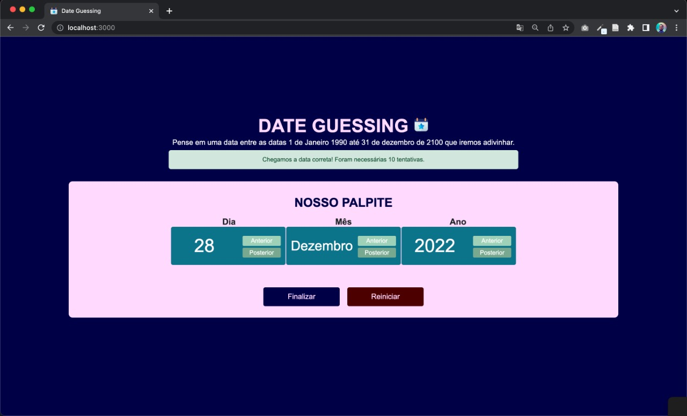

# D&C_DateGuessing

**Número da Lista**: 04<br>
**Conteúdo da Disciplina**: D&C<br>

## Alunos
|Matrícula | Aluno |
| -- | -- |
| 18/0028685  |  Victor Samuel dos Santos Lucas |
| 17/0115500  |  Vinícius Vieira de Souza |

## Sobre 
Este projeto tem como objetivo servir como base para implementação de algoritmos relacionados a estudos voltados ao conteúdo de Dividir e Conquistar (D&C).

O projeto em questão trata-se de uma aplicação que faz uso da técnica de mediana das medianas dentro dos conceitos de dividir e conquistar para realizar uma busca e adivinhar uma data imaginada pelo usuário em um certo intervalo.


## Screenshots
## - Tela Inicial


## - Tela apos procura de data


## - Tela após finalizar Date Guessing


## Instalação 
**Linguagem**: Javascript<br>
**Framework**: React<br>

### Requisitos:
- Npm: Versão 6+
- Node: Versão 16+

## Uso 
### Passo 1:
No diretório /app acesse o terminal e execute o seguinte comando:
```terminal
npm i
```

### Passo 2:
Ainda dentro do /app inicia a aplicação com:
```terminal
npm start
```

## OBS:
- O frontend faz uso da portas: http://localhost:3000, dessa forma certifique-se de que esteja livre para rodar a aplicação.

## Outros 

- Clique [aqui](assets/D&C_Date_Guessing.mp4) para baixar o vídeo.

- Link para video no Youtube [aqui](https://youtu.be/ZAOLfC7Tvnw)

- Caso nenhuma das opções esteja disponível, o vídeo encontrasse dentro do repositório no caminho "assets/D&C_Date_Guessing.mp4".


